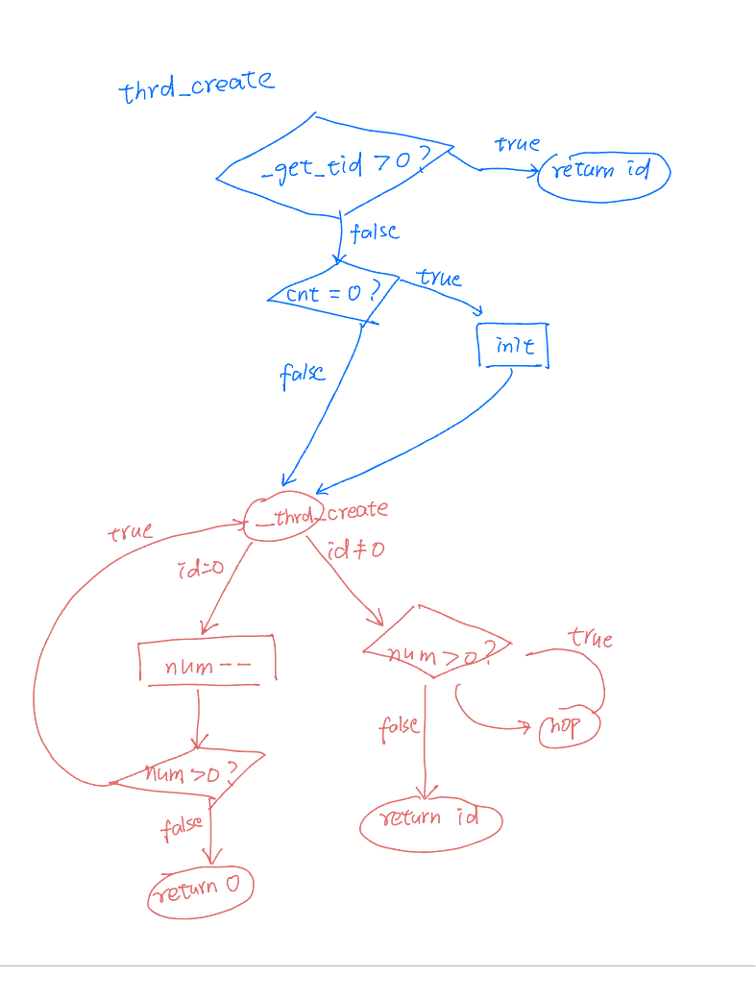
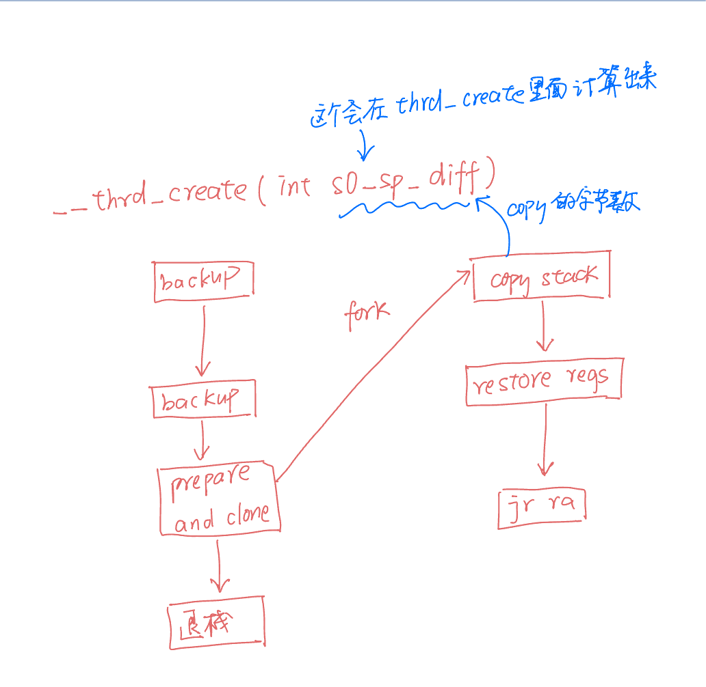
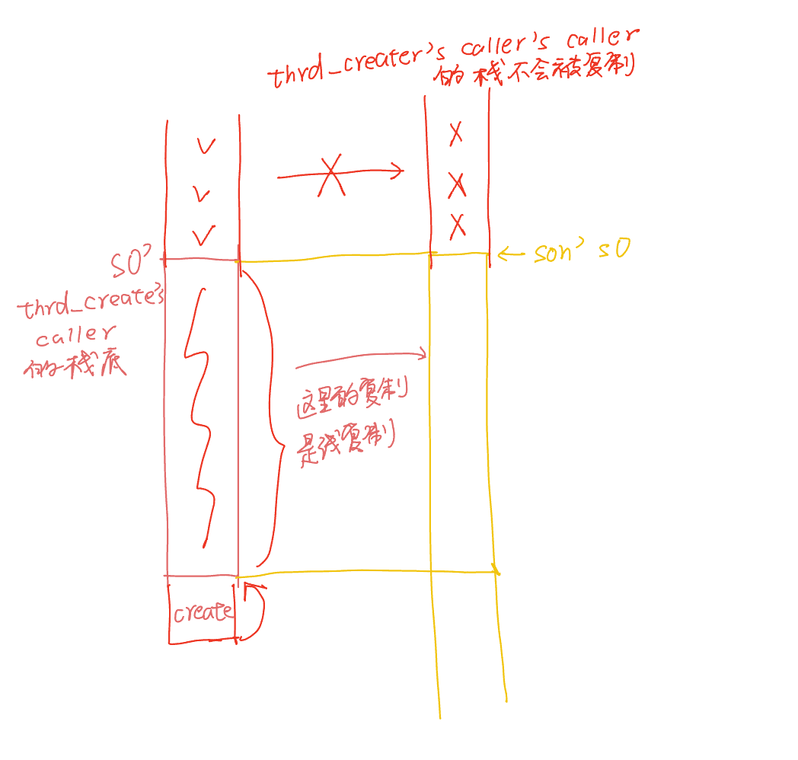
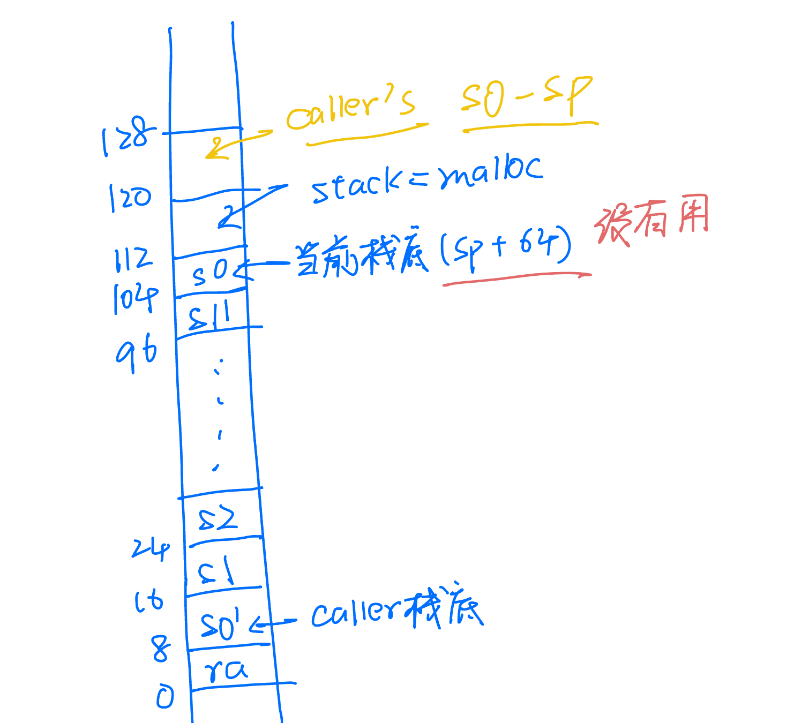

# README 线程库 实现原理

## thrd_create



### \_\_thrd_create



我这里其实 s0_sp_diff 其实做了一个假设：thrd_create 的 caller 线程 s0 按照调用惯例指向了 栈底。

栈拷贝:



```c
void* stack;
posix_memalign(&stack, 16, STACK_SIZE);
if (stack == NULL) {
	// perror("posix_memalign stack error\n");
	return -1;
}
char* stack_top = (char*)stack + STACK_SIZE; // 指向栈顶
int flags = CLONE_VM | CLONE_FS | CLONE_FILES | CLONE_SIGHAND
			| CLONE_THREAD | CLONE_SYSVSEM | CLONE_CHILD_CLEARTID | CLONE_CHILD_SETTID | CLONE_PARENT_SETTID;
int cnt = ++tids[0];
int ret = clone(child_entry, stack_top, flags, NULL, &tids[cnt], NULL, NULL);
return cnt;
```

我们这里 id 与 tids 的下标正好差一位，意思就是: `tids[id+1] == gettid()`，当然用户没必要知道这个 id 对应的 tids 的下标。

`tids[0]`也就是 cnt, 用来生成 线程 id 的。

这个 backup 的区域是:



## mtx

利用了 futex

## thrd_join

```c
int thrd_join(void)
{
    if (syscall(SYS_gettid) == tids[1]) { // 主线程

        __atomic_sub_fetch(&tids[0], 1, __ATOMIC_SEQ_CST); // 主线程自己 --

        while (__atomic_load_n(&tids[0], __ATOMIC_SEQ_CST) > 0) {
            __asm__ volatile("nop"); // 空转
        }

        // 释放 线程的栈空间
        // 如果 tmp_mem[i << 8] != 0 说明曾经有过东西，释放！
        for (int i = 2; tmp_mem[i << 8]; i++) {
            char* tmp = (char*)tmp_mem + (i << 8);
            uint64_t stack = *(uint64_t*)(tmp + 112);
            free((void*)stack);
            memset(tmp, 0, 128); // 清空，以免影响循环判断条件
            stack = 0; // stack = NULL
        }

        memset(tids, 0, sizeof(pid_t) * (THREADS_NUM + 1));

    } else {

        __atomic_sub_fetch(&tids[0], 1, __ATOMIC_SEQ_CST);

        while (1) { // 子线程
            syscall(SYS_exit, 0);
        }
    }

    return 0;
}
```
